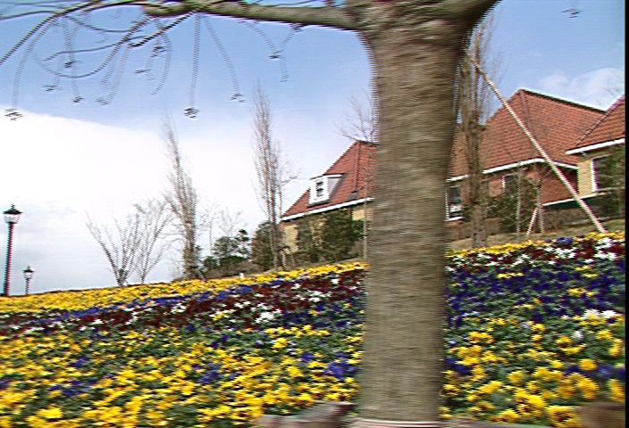
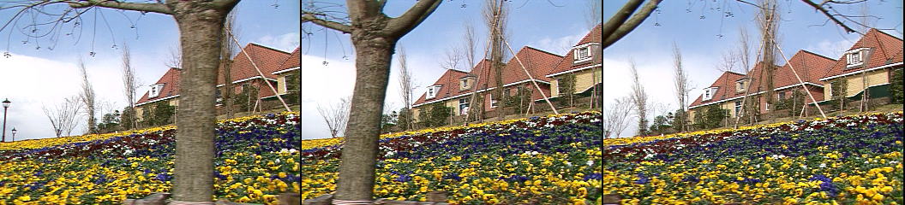
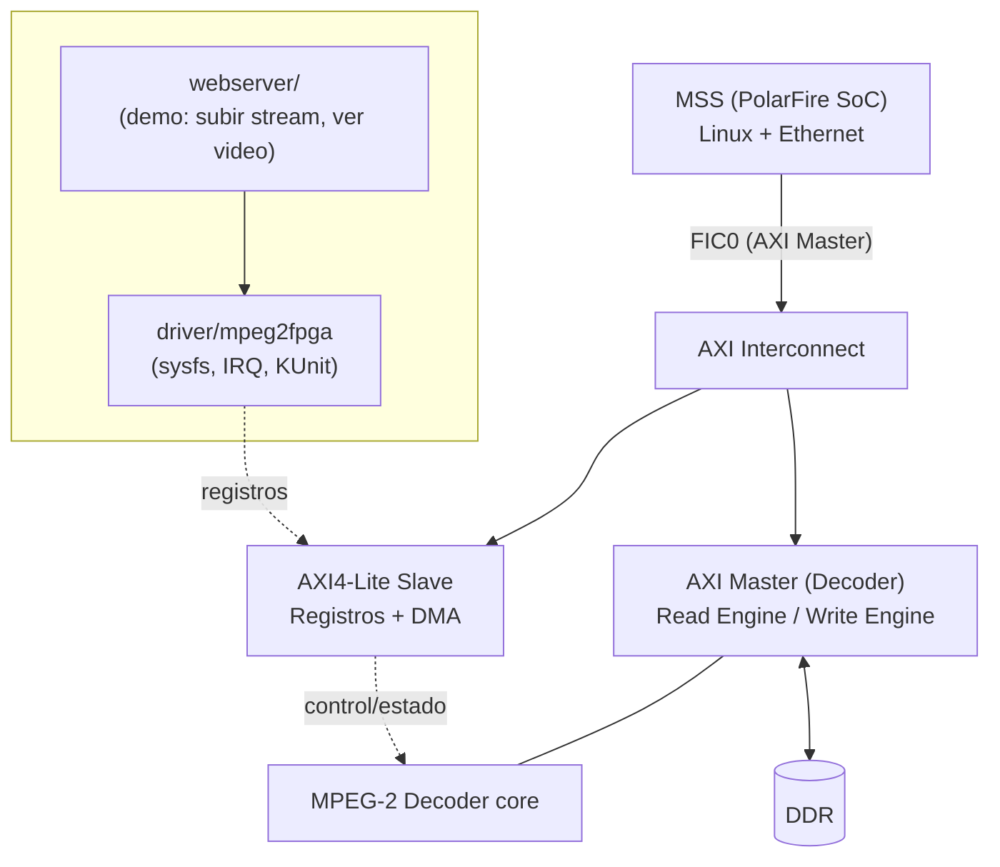
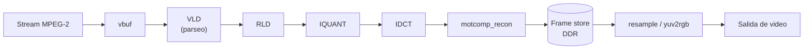

# mpeg2fpga sobre PolarFire SoC

Port de **mpeg2fpga** — un decoder MPEG-2 (ISO/IEC 13818-2) en Verilog de código abierto,
originalmente orientado a Xilinx, por Koen De Vleeschauwer — a un **Microchip PolarFire SoC**,
controlado desde Linux por un módulo de kernel propio a través de AXI4.

El objetivo es un decodificador de nivel industrial: correr el core en la lógica de fábrica de la
FPGA, lejos de las primitivas específicas de Xilinx del diseño original, y manejarlo por completo
desde el software que corre en el MSS (los cores RISC-V del SoC).

**Estado: decodifica video real en hardware, verificado bit a bit contra un decoder de
referencia.** Ver [Estado actual](#estado-actual) más abajo.

## Demo

Un frame reconstruido por el decoder, subiendo un stream `.mpg` desde el navegador y leyéndolo de
vuelta de la memoria de la placa:



Y tres frames de una misma corrida (0, 30 y 59 de una secuencia de 60), mostrando que es video real
con movimiento, no una imagen fija:



## Estado actual

- **La cadena completa de reconstrucción es exacta en silicio.** Comparado contra el decoder de
  referencia (`tools/mpeg2dec`) con [`tools/framecmp`](trunk/mpeg2fpga/tools/framecmp/README): los
  frames intra salen con un error medio de 0.004 sobre 255 y error pico 1 — exactamente el margen
  que permite IEEE 1180-1990 entre dos IDCT conformes — y en un stream de contenido casi estático
  los cuatro buffers de frame salen **bit a bit idénticos** a la referencia.
- **El port no le agrega ninguna diferencia al diseño original.** Corriendo el mismo stream por
  simulación (Icarus Verilog) y por hardware real, el frame store resultante es **byte por byte
  idéntico** en los dos caminos.
- **Queda un margen de error chico en la predicción entre frames** en streams con mucho movimiento
  (invisible a simple vista incluso en el peor caso medido) — y está también en la simulación
  original, sin nada de PolarFire de por medio, así que no es un bug del port. Se deja como está: la
  idea es no tocar el core de terceros salvo que en la práctica se note.
- **El decoder corre de forma continua**: empujar un stream después de otro sin resetear el core
  (solo `flush_vbuf`), y pausar/reanudar en caliente (`repeat_frame`), tal como lo previó el diseño
  original — ver la sección 1.11 de `doc/mpeg2fpga.txt`.
- **El módulo de kernel** (`driver/mpeg2fpga`) es dueño de todo el mapa de registros — incluidas las
  extensiones del bridge AXI (DMA, contadores de depuración, control del core) que antes vivían
  como constantes sueltas copiadas entre scripts de Python — con tests unitarios vía **KUnit** y una
  interfaz `sysfs`.
- **Primera release publicada: [`v0.0.1`](https://github.com/esbon125/tandem/releases/tag/v0.0.1).**

Lo que sigue abierto: salida de video real por el conector (el camino de display corre pero nunca
se verificó contra una pantalla), y llevar la tasa de decodificación actual (~7 fps a 704×480,
limitada por la latencia de memoria de un controlador AXI4 sin pipelinear) más cerca de tiempo real.

## Arquitectura



El core es un pipeline de streaming de ancho fijo (`doc/mpeg2fpga.txt` §2.2.1 tiene el diagrama
completo):



## Estructura del repositorio

Tres ramas de trabajo de larga vida, una por tipo de contenido, más `master` como punto de
integración de las releases (ver [Releases](#releases) abajo):

```
trunk/mpeg2fpga/     rama hardware_development — núcleo Verilog del decoder
  rtl/mpeg2/         RTL del decoder (IP de terceros bajo licencia MPEG-2, ver rtl/LICENSE-MPEG2)
  bench/iverilog/    testbench funcional (Icarus Verilog)
  bench/ieee1180/    test de precisión de IDCT contra IEEE 1180-1990
  tools/framecmp/    comparación de un frame decodificado contra el decoder de referencia
  tools/mpeg2dec/    decoder de referencia en C, para comparar
  mpeg2fpga/         proyecto Libero SoC (generado por la herramienta, no es RTL escrito a mano)

driver/              rama firmware_development — módulo de kernel (KUnit, sysfs)
webserver/           rama firmware_development — demo: subir un stream, verlo decodificado
renode/              rama firmware_development — modelo del periférico para TDD del driver sin hardware

docs/                rama docs — documentación técnica
  bringup/           bitácora de bring-up de la placa, numerada, un documento por hallazgo
  polarfire/         manuales y esquemáticos de referencia del hardware
```

## Probarlo

### Simulación

El único camino de test automatizado hoy es la simulación funcional con Icarus Verilog:

```sh
cd trunk/mpeg2fpga/bench/iverilog
make clean test
```

Llena el directorio de `tv_out_*.ppm` (frames decodificados) para inspección visual. El chequeo de
precisión de IDCT (`bench/ieee1180`) corre en 15 segundos:

```sh
cd trunk/mpeg2fpga/bench/ieee1180
make quick
```

### En hardware

Con la placa programada, el overlay de device tree aplicado y el módulo de kernel cargado
(`driver/mpeg2fpga/tools/install-on-board.sh`), el demo web queda en el puerto 8080:

```sh
ssh root@<placa> 'systemctl status mpeg2fpga-webserver'
```

Se sube un `.mpg`/`.bits` desde el navegador y se ve el resultado — es lo que muestran las capturas
de arriba.

## Releases

`docs`, `hardware_development` y `firmware_development` nunca se cierran ni se borran; cada release
fusiona el estado actual de las tres a `master` (workflow manual en
[`.github/workflows/release.yml`](.github/workflows/release.yml)) y taggea tanto el commit de
fusión (`vX.Y.Z`) como el HEAD que tenía cada rama en ese momento
(`vX.Y.Z-docs`, `vX.Y.Z-hardware_development`, `vX.Y.Z-firmware_development`).

## Licencias / IP de terceros

- El core MPEG-2 (`trunk/mpeg2fpga/rtl`) es IP de terceros bajo `rtl/LICENSE-MPEG2` — se prefieren
  diffs mínimos y acotados por sobre reescrituras.
- Cualquier IP de Microchip/Actel generada por Libero (DirectCore/SgCore — COREFIFO, PF_CCC, etc.,
  bajo `trunk/mpeg2fpga/mpeg2fpga/component/`) es propietaria y confidencial; no se trackea en git
  (ver `.gitignore` en ese directorio) y no debe redistribuirse sin autorización de Microchip.
