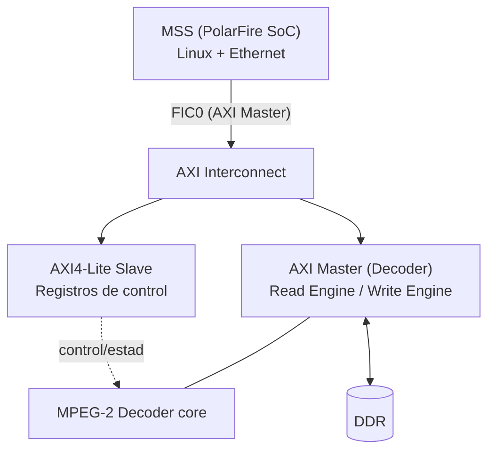

# Decodificador MPEG-2 industrial sobre PolarFire SoC

Tesis de ingeniería (anteproyecto/CIA) cuyo objetivo general es **implementar el firmware de
nivel industrial de un decodificador de video MPEG-2 (ISO/IEC 13818-2), prototipado en FPGA,
cumpliendo las etapas de investigación, diseño, implementación y optimización**.

El núcleo del trabajo consiste en portar **mpeg2fpga** — un decoder MPEG-2 en Verilog de
código abierto orientado a Xilinx (`trunk/mpeg2fpga`, por Koen De Vleeschauwer) — a un
**Microchip PolarFire SoC**, y finalmente correrlo/soportarlo desde software (Linux) en ese SoC.

## Meta final del sistema

La placa objetivo es el **Discovery Kit de Microchip (PolarFire SoC)**. El decoder corre como
lógica de fábrica (FPGA fabric) y es controlado por el **MSS** (los cores ARM Cortex-A del SoC,
corriendo Linux), que además expone el sistema por Ethernet. El firmware del lado Linux es un
**módulo de kernel** (con tests via **KUnit**) que habla con el decoder únicamente a través de
**AXI4** — un slave AXI4-Lite para registros de control/estado, y un master AXI4 propio del
decoder (motores de lectura/escritura) para acceder a DDR.



Primera prueba de concepto, deliberadamente simple, antes de optimizar nada:

1. `scp` de un archivo `.mpg` hacia la placa, se guarda en `/tmp`.
2. El módulo de kernel hace `mmap` de ese buffer.
3. El decoder lee el stream desde DDR vía su master AXI4 y decodifica.

## Fases de desarrollo (hardware)

| Fase | Contenido | Estado |
|------|-----------|--------|
| 1 | Sintetizar el decoder + reemplazar las FIFO36 (primitivas Xilinx) por alternativas portables/PolarFire | ✅ |
| 2 | Timing closure | ✅ |
| 3 | Agregar SmartDesign | 🔄 en definición — podríamos no depender de SmartDesign, se decide sobre la marcha |
| 4 | Agregar el MSS | ⏳ |
| 5 | Agregar AXI (interconexión decoder ↔ MSS) | ⏳ |

La rama `hardware_development` es donde se ejecuta este trabajo: portar `rtl/mpeg2/*.v` lejos de
primitivas específicas de Xilinx (Virtex-5 FIFO18/36, etc.) hacia equivalentes vendor-neutral o
específicos de PolarFire. Ver `CLAUDE.md` para el detalle técnico de qué se tocó y por qué
(wrappers de FIFO/RAM, clocking vía `PF_CCC_C0`, etc.).

## Estructura del repositorio

```
trunk/mpeg2fpga/   núcleo Verilog del decoder + todo lo necesario para simularlo
  rtl/mpeg2/       RTL del decoder (IP de terceros bajo licencia MPEG-2, ver rtl/LICENSE-MPEG2)
  bench/iverilog/  testbench funcional (Icarus Verilog) - único camino de test automatizado
  mpeg2fpga/       proyecto Libero SoC (generado por la herramienta; no es RTL escrito a mano)
  tools/           streams de prueba MPEG-2 y utilidades (decoder de referencia, etc.)
docs/              fuentes LaTeX/PDF de los entregables académicos y manuales de PolarFire
  anteproyecto/    anteproyecto de la tesis
  cia/             informe CIA
  propuesta/       propuesta original de la idea
  polarfire/       manuales/esquemáticos de referencia del hardware
```

## Simulación rápida

El único camino de test automatizado hoy es la simulación funcional con Icarus Verilog:

```sh
cd trunk/mpeg2fpga/bench/iverilog
make clean test
```

Esto llena el directorio de `tv_out_*.ppm` (frames de video decodificados) para inspección
visual. Ver `trunk/mpeg2fpga/bench/README` y `CLAUDE.md` para más detalle.

## Licencias / IP de terceros

- El core MPEG-2 (`trunk/mpeg2fpga/rtl`) es IP de terceros bajo `rtl/LICENSE-MPEG2` — se prefieren
  diffs mínimos y acotados por sobre reescrituras.
- Cualquier IP de Microchip/Actel generada por Libero (DirectCore/SgCore — COREFIFO, PF_CCC, etc.,
  bajo `trunk/mpeg2fpga/mpeg2fpga/component/`) es propietaria y confidencial; no se trackea en git
  (ver `.gitignore` en ese directorio) y no debe redistribuirse sin autorización de Microchip.

## Documentación

Además de esta tesis (memoria técnica completa en `docs/`), la idea es publicar más adelante una
GitHub Page del proyecto con un **User Guide** y un **Reference Manual** derivados de este mismo
trabajo.
